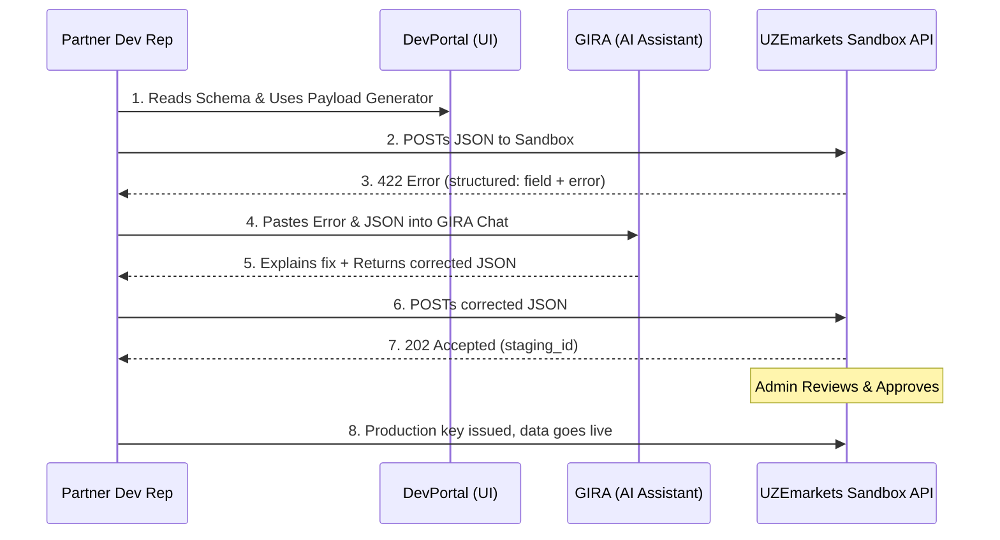

# Partner Self-Serve Integration Flow

```mermaid
sequenceDiagram
    participant P as Partner Dev Rep
    participant Portal as DevPortal (UI)
    participant GIRA as GIRA (AI Assistant)
    participant API as UZEmarkets Sandbox API

    P->>Portal: 1. Reads Schema & Uses Payload Generator
    P->>API: 2. POSTs JSON to Sandbox
    API-->>P: 3. 422 Error (structured: field + error)
    P->>GIRA: 4. Pastes Error & JSON into GIRA Chat
    GIRA-->>P: 5. Explains fix + Returns corrected JSON
    P->>API: 6. POSTs corrected JSON
    API-->>P: 7. 202 Accepted (staging_id)
    Note over API: Admin Reviews & Approves
    P->>API: 8. Production key issued, data goes live
```
