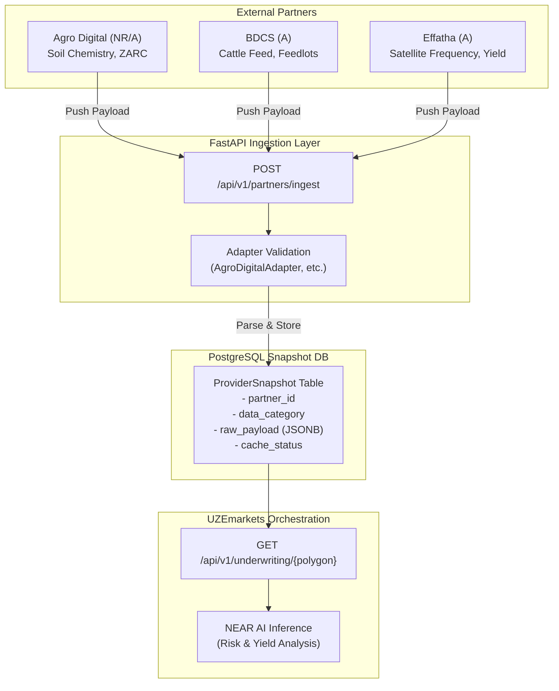

# Internal Partner Orchestration Architecture

```mermaid
flowchart TD
    subgraph PARTNERS["External Partners"]
        AD["Agro Digital (NR/A)<br/>Soil Chemistry, ZARC"]
        BD["BDCS (A)<br/>Cattle Feed, Feedlots"]
        EF["Effatha (A)<br/>Satellite Frequency, Yield"]
    end

    subgraph API["FastAPI Ingestion Layer"]
        EP["POST /api/v1/partners/ingest"]
        VAL["Adapter Validation<br/>(AgroDigitalAdapter, etc.)"]
    end

    subgraph DB["PostgreSQL Snapshot DB"]
        SNAP["ProviderSnapshot Table<br/>- partner_id<br/>- data_category<br/>- raw_payload (JSONB)<br/>- cache_status"]
    end

    subgraph CORE["UZEmarkets Orchestration"]
        UW["GET /api/v1/underwriting/{polygon}"]
        AI["NEAR AI Inference<br/>(Risk & Yield Analysis)"]
    end

    AD -->|Push Payload| EP
    BD -->|Push Payload| EP
    EF -->|Push Payload| EP

    EP --> VAL
    VAL -->|Parse & Store| SNAP

    SNAP --> UW
    UW --> AI
```
