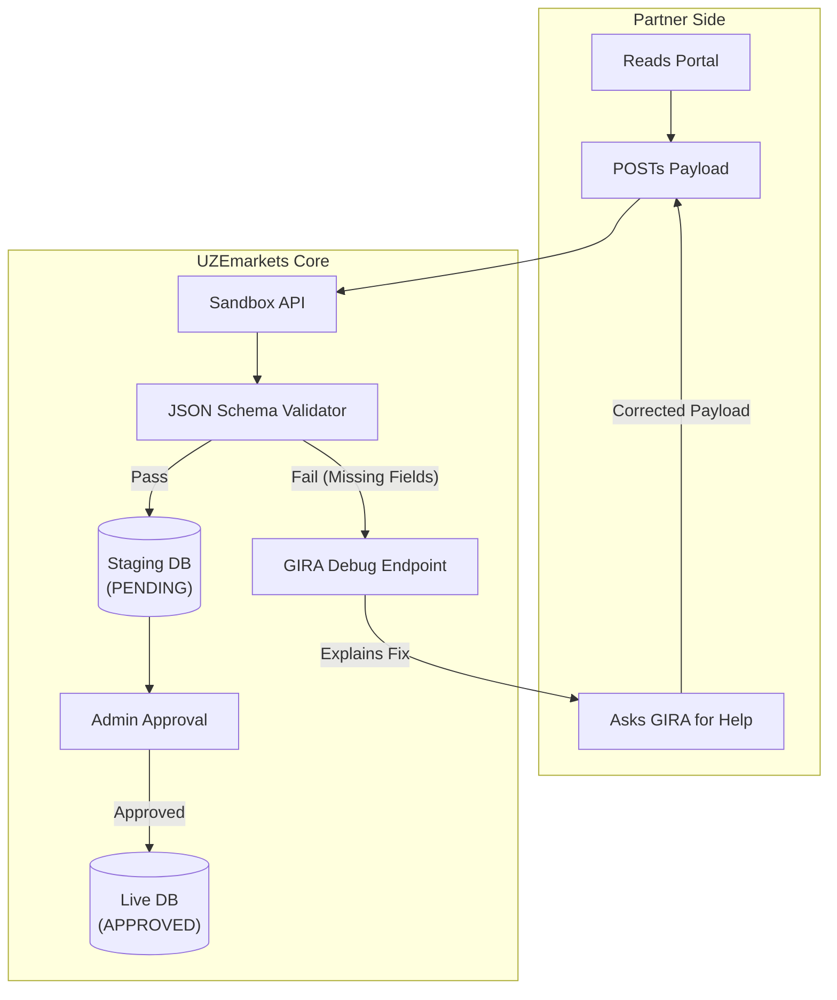

# Internal Agentic DevPartner Architecture

```mermaid
flowchart TD
    subgraph PARTNER["Partner Side"]
        P_DOCS["Reads Portal"]
        P_POST["POSTs Payload"]
        P_DEBUG["Asks GIRA for Help"]
    end

    subgraph UZE["UZEmarkets Core"]
        API_SANDBOX["Sandbox API"]
        VALIDATOR["JSON Schema Validator"]
        GIRA_DEBUG["GIRA Debug Endpoint"]

        STAGING[("Staging DB<br/>(PENDING)")]
        ADMIN["Admin Approval"]
        LIVE[("Live DB<br/>(APPROVED)")]
    end

    P_DOCS --> P_POST
    P_POST --> API_SANDBOX
    API_SANDBOX --> VALIDATOR

    VALIDATOR -- "Fail (Missing Fields)" --> GIRA_DEBUG
    GIRA_DEBUG -- "Explains Fix" --> P_DEBUG
    P_DEBUG -- "Corrected Payload" --> P_POST

    VALIDATOR -- "Pass" --> STAGING
    STAGING --> ADMIN
    ADMIN -- "Approved" --> LIVE
```
