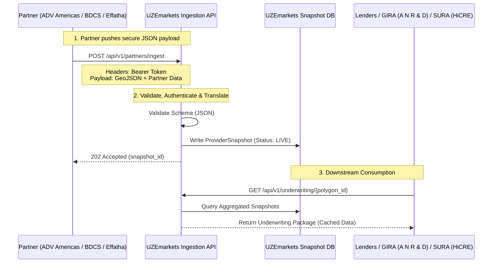

# Partner Data Ingestion Flow

```mermaid
sequenceDiagram
    participant P as Partner (ADV Americas / BDCS / Effatha)
    participant API as UZEmarkets Ingestion API
    participant DB as UZEmarkets Snapshot DB
    participant L as Lenders / GIRA (A N R & D) / SURA (HiCRE)

    Note over P,API: 1. Partner pushes secure JSON payload
    P->>API: POST /api/v1/partners/ingest
    Note right of P: Headers: Bearer Token<br/>Payload: GeoJSON + Partner Data

    Note over API: 2. Validate, Authenticate & Translate
    API->>API: Validate Schema (JSON)
    API->>DB: Write ProviderSnapshot (Status: LIVE)

    API-->>P: 202 Accepted (snapshot_id)

    Note over DB,L: 3. Downstream Consumption
    L->>API: GET /api/v1/underwriting/{polygon_id}
    API->>DB: Query Aggregated Snapshots
    API-->>L: Return Underwriting Package (Cached Data)
```
